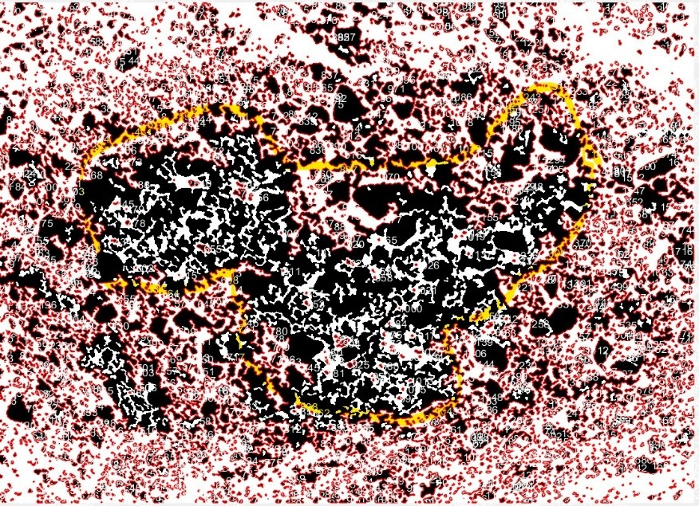
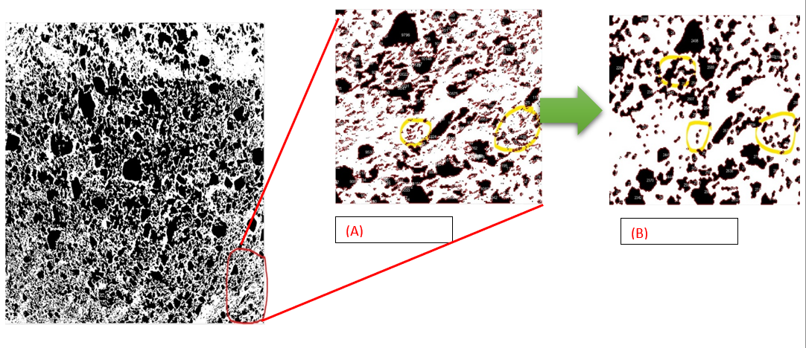

# image-processing-for-particle-size_ Using_MATLAB
## INTRODUCTION
This Code was prepaired for particle size detection of the coal over the weigh feeder for an industry (i.e. TATA Sponge jodha, INDIA,  :)Thanks!).
The particle size of the raw material i.e. iron ore, coal, and dolomite are measured frequently in order to maintain the particle size distribution of the input material which has some direct and indirect effects on the quality of the produced sponge iron.

Image processing is a subcategory of digital signal processing which is used to remove noise and signal irregularities followed by generating data from the digital image for future analysis (moisture prediction). Currently, it is used to predict particle size distribution in coal from the image using image analysis through MATLAB.

## MATLAB and Image Processing
MATLAB is used for image analysis as it is more prompt for matrix analysis and the image obtained is nothing but a 3D matrix with red, green and blue as its 3rd dimension.

The process of analysis is divided into four steps which are **first**, RGB to BW image conversion for dimension reduction. **Second**, morphological operation to reduce irregularities and giving structure to the coal particle in the binary image. **Third**, obtaining basic information i.e. area for each particle observed in the image. **Forth**, classifying particles on the basis of area of 3mm particle.

During Cross-Validation of the model with the sieve analysed data outcome of several samples we come up with an observation that the particle size prediction is not accurate when the percentage of fine particles is high which means when the percentage of particle size less than 3mm error increases. If we create a boundary around each particle (i.e. red in colour which may be difficult to observe), we observed that fine particles which are very close to each other or overlapping each other are considered as a single particle which acts as an anomaly in our prediction model.

`Figure: all the fine particles are clustered and forming a single particle inside yellow highlights by the model`

## Tuning and training MATLAB functions
Here for anomaly detection, we need to implement a boundary around each particle for better observation using the simple MATLAB functions.
**1.** `bwlabel` = it gives a label to each particle which is completely separated to each other. 
**2.** `Regionprops`= it gives the number to each particle and also determines the centroid coordinate of each.
**3.** `Bwboundries`= using the label from bwlabel it will create a boundary around each particle.

**4.** `for` loop is used to display the label number obtained from bwlabel of the particle on its centroid obtained from regionprops.
Noise due to the blurred image and during RGB to BW formation unstructured particle shape are formed instead of clearer particle which needs to be removed and structured for further processing could be done using MATLAB functions.

 **1.** `bwareaopen` = It considers a particle as the same particle if their pixels are connected by horizontal or vertical direction, also it is used to removes particles in an image containing fewer than certain pixels.
 **2.** `bwmorph` = On the basis of majority (Sets a pixel to 1 if five or more pixels in its 3-by-3 neighbourhood are      1s; otherwise, it sets the pixel to 0) it will help to give structure to the particles.
Various input parameters are tuned by observing the particles after implementing boundary around each particle and particle size distribution using `regionprop`.

`Figure: Before(A) and after(B) morfological operation`

Morphological operations generally come up with one problem which is a clustering of two or more closely arranged particle. Therefore, now the model is considering those clusters as a single particle which will affect the particle size prediction. To overcome that issue, we implemented segmentation operations for dividing the particles.
1.  `bwdist` = It computes the Euclidean distance transform of the binary image BW. For each pixel in BW, the distance transform assigns a 	number that is the distance between that pixel and the nearest nonzero pixel of BW. (it creates a gradient of intensity inside the particle, we consider a particle as white and background as black so we need to use this function as “-bwdist(~bw)” where ‘bw ‘is image matrix).
2. `watershed` = Function used for segmentation of particle by treating the image as a surface where light pixels represent high elevations and dark pixels represent low elevations (therefore we required to create a gradient using `bwdist`)
Directly using these functions leads to over-segmentation observed in figure below.

`Figure: over-segmentation using the watershed function`

